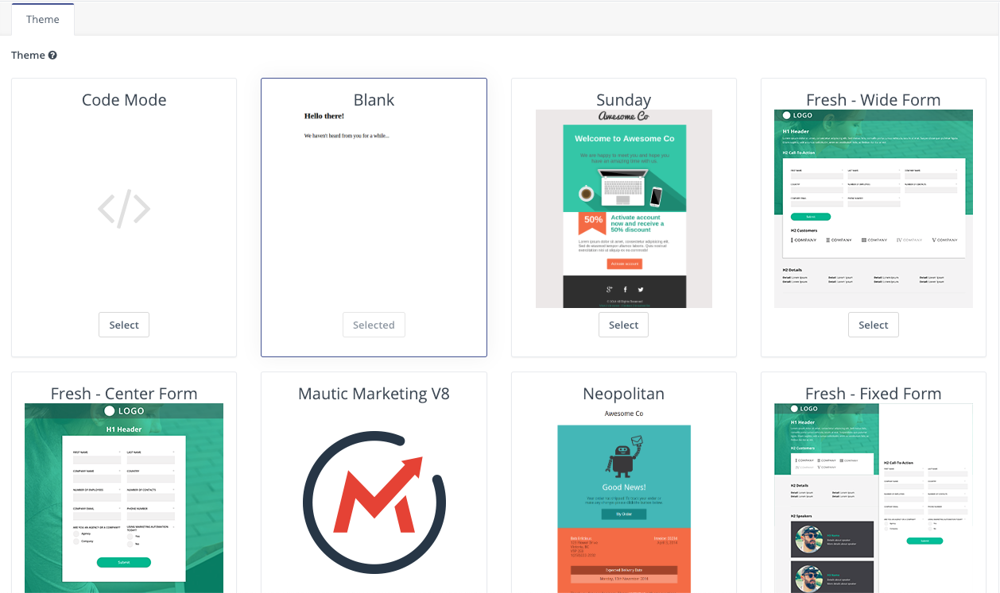
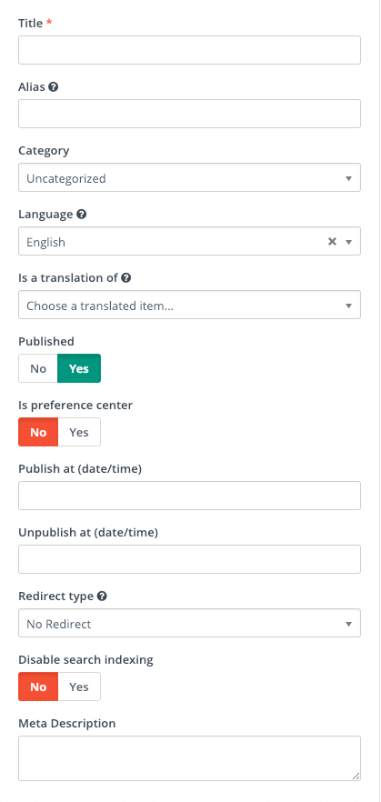

Landing pages are a powerful feature that enable you to do more than just publish content quickly and easily. Using landing pages can give you insight to what kind of content your contacts are interested.

## Why do we use Landing pages in Mautic
* It give you insight to what kind of content interest your contacts
* It can help you obtain more information about your contacts.

## Basics of landing pages
### Themes

Campaign Studio includes several themes out of the box. These themes are editable. You can choose your own colors, images, styles, and more. Some of themes are available for a combination of emails, landing pages, and form styling.

The Fresh themes are created specifically for landing pages, with specific areas designed to contain forms. You can create a custom theme, making branding more consistent with less effort on each new landing page. To start creating your own custom theme(s), see [Theme Directory Structure][Theme Directory Structure]. Users may also select the Code Mode theme to create landing pages entirely in HTML.

> Note: Once you’ve built a landing page, changing the theme will delete the content. Its recommended you create a new landing page with the new theme, then recreate your content to avoid loss of content.

### Sidebar options

* **Title:** The name displayed in your lists of landing pages, either on the item page or in the tokens menu in case you’d like to add a link to a particular page in an email. Acquia recommends having a naming convention for your landing pages. Naming conventions keep your list organized and help team members find pages.
Alias:  A machine name, which becomes the slug in the URL of the page. For example, you may title a landing page something like WR: Acquia + Mautic, where the WR: stands for Webinar Registration. The alias can be something like webinar-acquia-mautic. When set, the URL becomes https://subdomain.yourcompany.com/webinar-acquia-mautic when a person goes to the page.
Category: Organize your landing pages based on their goals, campaigns, etc. See Global Categories to learn more.
Language & Is a translation of: If contacts in multiple countries will be visiting your landing pages, Campaign Studio can identify those countries and display content in the appropriate languages. You must create the content for each of those languages. Select the language you’re building the page in and the main page you’re translating. For example, if you primarily use English, you can create a French version which appears when someone visits the page from France. Create the English version and label it as English, then create the French version. Add the French label, and select the English version in the Is a translation of box.
Publish options: The Yes/No toggle is the fastest way to publish or unpublish a page. If it’s unpublished, any contacts who visit the URL will see either an error page or will be redirected to a different URL (see Redirect type). Set the beginning, end, or both dates & times for the period you’d like the page to be active. This helps control relevance, and prevents users from needing to manually publish or unpublish pages at the right times.
Is preference center: Users can create custom Preference Center pages in line with their branding than the default preferences. See Preference centers to learn more. To turn a page into a Preference Center page, select Yes.
Redirect type: If the content on your landing page is out of date, you can unpublish your landing page and still have contacts who find it go to a relevant page of your choice. If a contact finds an old post or email with a link to a landing page, instead of seeing an Oops! page, you can send users to a specific page. Typically, you’ll want to use a 301 permanent redirect.
Disable search indexing: To prevent a landing page displaying in search results toggle the switch to Yes. To keep your page available for search engines to find, leave the setting at No (default).
Meta Description: Adding a meta description is a best practice for SEO. Search engines display this snippet with the results, as a description the page content.
[Theme Directory Structure]: <https://developer.mautic.org/#themes>