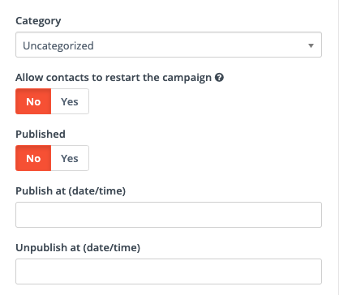
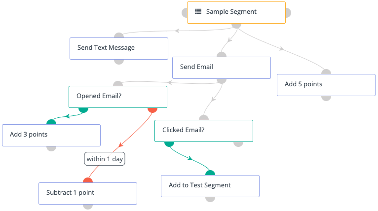

Creating campaigns involves picking a name, creating a description, and defining the segments to associate with the campaign. These campaigns can then be assigned a category and defined publishing information.

## Why use a campaign

* Most marketers think of campaigns as being ways to communicate with their contact list. Campaigns can also be useful for lead management, marketing operations, and sales enablement. 
* You can incorporate multiple decisions, behaviour triggers and actions.
* These are displayed clearly so that almost anyone could look at it an immediately understand what is going on.
* There’s a drag and drop function which you use to build your conditions, actions, decisions and you name them yourself, so you’re always able to recognise what is happening or about to. It’s best to label these as literally as you can, to avoid any confusion later.
* You build a comprehensive flow and deliver relevant content to your potential customer based on their own behaviours.

## How to create your first campaign 
1. Before using the campaign builder, Click on **+ New** you’ll want to give your campaign a name. It’s also helpful to add a description so your colleagues know what the campaign is for at a glance. 

2. **Allow contacts to restart the campaign**: One contact (based on ID) usually can’t repeat the same campaign ID. Enable this option if you’re building a campaign for a recurring message (birthdays, subscriptions) or transactional operations (activity notifications, adding to a lead score, updating data, etc.) Contacts can go through the same campaign multiple times without you having to clone the campaign.

> Note: Contacts can’t restart a campaign until they have been removed from the campaign. This doesn’t have to be manual for every contact. There’s an action option in the campaign builder to remove contacts once they’ve gone through a campaign.

3. **Publish options**: Be careful not to publish a campaign until you’re actually ready for it to go live. If there are already contacts in a campaign, changes to a published campaign won’t always apply to those contacts. Changes beyond any already scheduled (including pending) events will apply. If the changes are to already scheduled events, they won’t apply. Changes won’t apply if the contact has already passed the stage in the campaign you’re making changes to. Adding new events directly from the contact source won’t apply to contacts already in the campaign.

To schedule a campaign’s publish date and time:

* Add the date and time into the **Publish options** text box.
* Set **Published** to **Yes**.
* This marks the campaign as **Pending**, until the date and time you’ve selected and will publish the campaign then. You can also unpublish a campaign at a pre-determined date and time.

4. **Testing**: It’s often a good idea to start with a test campaign, using a segment of internal contacts or users as the contact source. Once you’ve built and tested the campaign and are happy with how it works, clone it and add the source you want to actually go through the campaign. In testing, you can also use different time periods - so instead of waiting a week for your next email, you can set it to send after 5 minutes.

## Campaign builder
To get started with the campaign builder. Click on **Launch Campaign Builder**.

Campaigns are triggered to either segments, or contacts who submit forms. Once you’ve selected either segments or forms, you’ll select the actual segments or forms to use.

## Adding events
After selecting a contact source, click the gray semi-circle at the bottom of the source box to select an event type.

Once you’ve chosen an event type and added an event, you’ll either see two connectors (decisions and conditions) or one connector (actions).

**Decisions** and **Conditions** have `yes` and `no` paths. 

When the contact meets the criteria for the decision or condition, they follow the `yes` path. 
To add events on the yes path, click the green connector on the left side of the event box. If the contact doesn’t meet the criteria for the decision or condition, they follow the `no` path. To add events on the no path, click the red connector on the right side of the event box. 

The lines connecting the decision or condition and the next event match the connector color to help follow the contact’s journey. 
Campaign Studio’s campaign builder is non-linear and multi-channel. It’s possible to have several actions happening at the same time, or mix decisions, actions, and conditions at one time in a campaign.

