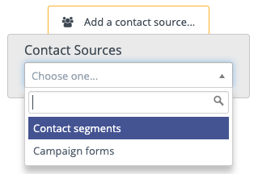
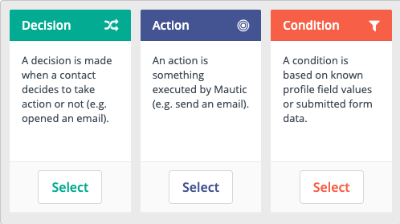
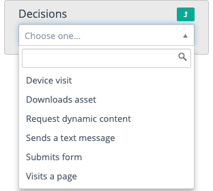
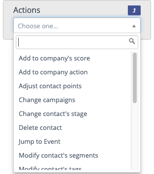
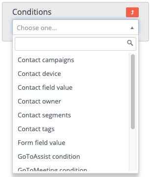

Creating campaigns involves picking a name, creating a description, and defining the segments to associate with the campaign. These campaigns can then be assigned a category and defined publishing information.

## Why use a campaign

* Most marketers think of campaigns as being ways to communicate with their contact list. Campaigns can also be useful for lead management, marketing operations, and sales enablement. 
* You can incorporate multiple decisions, behaviour triggers and actions.
* These are displayed clearly so that almost anyone could look at it an immediately understand what is going on.
* There’s a drag and drop function which you use to build your conditions, actions, decisions and you name them yourself, so you’re always able to recognise what is happening or about to. It’s best to label these as literally as you can, to avoid any confusion later.
* You build a comprehensive flow and deliver relevant content to your potential customer based on their own behaviours.

## How to create your first campaign 
1. Before using the campaign builder, Click on **+ New** you’ll want to give your campaign a name. It’s also helpful to add a description so your colleagues know what the campaign is for at a glance. 

2. **Allow contacts to restart the campaign**: One contact (based on ID) usually can’t repeat the same campaign ID. Enable this option if you’re building a campaign for a recurring message (birthdays, subscriptions) or transactional operations (activity notifications, adding to a lead score, updating data, etc.) Contacts can go through the same campaign multiple times without you having to clone the campaign.

> Note: Contacts can’t restart a campaign until they have been removed from the campaign. This doesn’t have to be manual for every contact. There’s an action option in the campaign builder to remove contacts once they’ve gone through a campaign.

3. **Publish options**: Be careful not to publish a campaign until you’re actually ready for it to go live. If there are already contacts in a campaign, changes to a published campaign won’t always apply to those contacts. Changes beyond any already scheduled (including pending) events will apply. If the changes are to already scheduled events, they won’t apply. Changes won’t apply if the contact has already passed the stage in the campaign you’re making changes to. Adding new events directly from the contact source won’t apply to contacts already in the campaign.

To schedule a campaign’s publish date and time:

* Add the date and time into the **Publish options** text box.
* Set **Published** to **Yes**.
* This marks the campaign as **Pending**, until the date and time you’ve selected and will publish the campaign then. You can also unpublish a campaign at a pre-determined date and time.

4. **Testing**: It’s often a good idea to start with a test campaign, using a segment of internal contacts or users as the contact source. Once you’ve built and tested the campaign and are happy with how it works, clone it and add the source you want to actually go through the campaign. In testing, you can also use different time periods - so instead of waiting a week for your next email, you can set it to send after 5 minutes.

## Campaign builder
To get started with the campaign builder. Click on **Launch Campaign Builder**.

Campaigns are triggered to either segments, or contacts who submit forms. Once you’ve selected either segments or forms, you’ll select the actual segments or forms to use.

## Adding events
After selecting a contact source, click the gray semi-circle at the bottom of the source box to select an event type.

Once you’ve chosen an event type and added an event, you’ll either see two connectors (decisions and conditions) or one connector (actions).

**Decisions** and **Conditions** have `yes` and `no` paths. 

When the contact meets the criteria for the decision or condition, they follow the `yes` path. 
To add events on the yes path, click the green connector on the left side of the event box. If the contact doesn’t meet the criteria for the decision or condition, they follow the `no` path. To add events on the no path, click the red connector on the right side of the event box. 

The lines connecting the decision or condition and the next event match the connector color to help follow the contact’s journey. 
Campaign Studio’s campaign builder is non-linear and multi-channel. It’s possible to have several actions happening at the same time, or mix decisions, actions, and conditions at one time in a campaign.

## Event Types
Decisions are behaviors from your contacts, or actions your contacts take. The options for decisions will change based on the campaign actions before the email. If a contact does something, Campaign Studio sends them down the green path on the left side of the bottom of the condition box, which indicates yes. If not, the contact goes down the red path on the right.

* **Clicks email:** appears after Send email action Did the contact click any link in an email you sent? Did the contact click a specific link, or any one of a set of specific links from your email? To track specific link clicks for the campaign, use the Add a value option and paste in the links you care about for the decision. When empty, this decision tracks any link in your email.
* **Device visit:** Did the contact visit your page from a specific device type, brand, or operating system? Set the options you care about tracking in the event editor.
* **Downloads asset**: Did the contact download an asset, either from a link on your website, your webpage, from an email you sent them, or from a form they submitted? After selecting this event type, you can limit the tracking to specific assets.
* **Opens email:** appears after Send email action Did the contact read the email you sent in the campaign?
* **Replies to email:** appears after Send email action If you’re using the monitored inbox settings in configuration, you can track if a contact replied to an email you sent. In many cases, if a contact replies you’d want to remove them from the campaign.
* **Request dynamic content:** If you have a webpage or landing page where you want to add dynamic content, you can push campaign-based dynamic content within the campaign builder. The slot name is what you name the slot in the code on your webpage:

> When a contact *requests* a slot, it means they're a member of that campaignand they visit the page that the dynamic content is on. When building thecampaign, follow this decision with an action type of **Push dynamic content**.

**Sends a text message**: If your Twilio account is set up to receive inbound text messages, you can track if a contact has sent you a text message with a certain pattern of text. For example, if you had an ad campaign with the instruction to text Campaign Studio to a specific phone number, you can look for text messages which include Campaign Studio. To look in your SMS inbox for any message, leave the Pattern the reply should match field empty.

**Submits form**: Did the contact submit any of your Campaign Studio forms? You can also limit this decision to track specific forms, so the contact submitting a form relevant to this campaign meets the decision criteria, but other forms do not meet the criteria.

**Visits a page**: Did the contact visit any of your landing pages? Did they visit a tracked page on your website? Did they come from a specific referrer URL? Select any of these options in this decision type.

## Actions

Actions are events which require Campaign Studio to do something to the contact or contact record. These can represent sending communications to the contact, or automated operational tasks to keep your marketing running. A single campaign, and even a single stage in a campaign, can include many actions and types of actions.

* **Add to company’s score**: When a contact reaches this event in a campaign, Campaign Studio adds or subtracts a designated number of points to or from the score for all companies the contact is associated with. To subtract points, use a negative number in the score box (for example: `-10`).

* **Add to company action:** This event associates a contact with a company, and sets the company as the primary company for the contact.

* **Adjust contact points**: Adds or subtracts points from the contact’s point total. To subtract, use a negative number (for example: `-10`).

* **Change campaigns**: Moves a contact into a different campaign, removes a contact from the current campaign, restarts the current campaign or a combination of these. A contact must be removed from a campaign before they can begin the campaign again.

* **Change contact’s stage:** Moves a contact from one stage to another, using the stages defined in the Stages tab.

* **Delete contact**: Permanently deletes the contact record. Deleting a segment containing the contacts doesn’t delete the contacts - only the segment. Contacts may be re-added to Campaign Studio, but the contact history is lost when a contact is deleted.

* **GoToAssist action**: Displays with GoToAssist plugin enabled. Sends the contact a template email with a link to GoToAssist.

* **GoToMeeting action**: Displays with GoToMeeting plugin enabled. Adds the contact to a GoToMeeting and sends a template email with a link to join the meeting.

* **GoToTraining action**: Displays with GoToTraining plugin enabled. Either registers the contact to a training session or sends a link to start a training session.

* **GoToWebinar action**: Displays with GoToWebinar plugin enabled. Registers the contact for a selected webinar.

* **Jump to Event**: Enables users to move contacts from one point in a campaign to another, without having to rebuild certain events. If your contact didn’t hit your goal at one point in the campaign, but does at a later stage, you can send the contact to a different path in the campaign by using a Jump To Event. For example, you may have a decision for Submits form with several events following the form submission. If the goal is to have a contact submit the form and you have the decision several times in the campaign, using the Jump to Event avoids building all the following events many times.

* **Modify contact’s segments:** Adds or removes contacts to/from segments. If a contact is removed from a dynamic (filter-based) segment by a campaign action, they won’t be re-added to the segment based on meeting the filter criteria.

* **Modify contact’s tags**: Use to overwrite or append tags on a contact record. You have the option to append tags, remove tags, or do both if you’d like to overwrite existing tags.

* **Push contact to integration**: Sends the contact record to the selected integration, either creating a new contact in the chosen integration or updating the connected contact record. The Salesforce plugin has an option to add a contact to a Salesforce Campaign.

* **Send a webhook**: Sends a webhook to a defined URL, with GET, POST, PUT, PATCH, or DELETE methods. Headers and data are customizable, including the use of tokens (for example, {contactfield=firstname}).

* **Send email**: Sends the contact an email.

> Note: Transactional emails may be sent to contacts multiple times, either in the same campaign or across campaigns. Marketing emails may only be sent once to each contact across all campaigns. Transactional emails ignore the default frequency rule. For more information, see frequency rule.

* **Send email to user**: Sends a template email to a person or people other than the contact. This may be a specific user or users, the contact’s owner (dynamically sent), or non-users using the To: field. Tokens in the email will display the data from the contact record, not Campaign Studio user data. Emails sent using this action won’t count in statistics for the email.

* **Send marketing message:** Sends content using the contact’s preferred channel, if the selected marketing message uses the same channel. See Marketing Messages for more information.

* **Send mobile notification**: Displays when an integration with a mobile push provider, such as the OneSignal plugin, is enabled. Sends the contact a mobile notification.

* **Send text message**: Displays when an integration with an SMS provider, such as the Twilio or Slooce plugins, is enabled. Sends the contact an SMS message.

* **Send web notification:** Displays when an integration with a web notification provider, such as the OneSignal plugin, is enabled. Sends the contact a web notification.

* **Show Focus Item**: Displays after the Visits a page decision. Displays the selected focus item on the page visited.

* **Tweet contact**: Displays when the Twitter plugin is enabled. @Replies to a contact, if the contact’s Twitter handle is stored in the Twitter field.

* **Update contact**: Updates selected data on the contact record.

* **Update contact’s primary company:** Updates selected data on the record for the company the contact is associated with as the primary company. This action doesn’t change associations between contacts and companies.

* **Update contact owner**: Updates the contact’s owner.

## Conditions

* **Contact campaigns**: Checks if the contact is a member of another Campaign Studio campaign.
* **Contact device**: Checks if the contact has interacted with your content (for example: email open or page visit) from a selected device type, brand, or OS.
* **Contact field value**: Checks if information exists or matches selected criteria on the contact record, the contact’s primary company, or UTM tags.
* **Contact owner**: Checks if a selected user (or any one of multiple selected users) is assigned as the contact’s owner.
* **Contact segments**: Checks if the contact is a member of selected segments.
* **Contact tags**: Checks if specified tags are on the contact record.
* **Form field value**: Checks if values submitted for a selected field on a selected form matches specified criteria.
* **GoToAssist condition**: Checks if the contact has attended any one of the selected sessions.
* **GoToMeeting condition**: Checks if the contact has attended any one of the selected meetings.
* **GoToTraining condition**: Checks if the contact has attended or registered for any one of the selected trainings.
* **GoToWebinar condition**: Checks if the contact has attended or registered for any one of the selected webinars.
* **Has active notification**: Checks if there’s an active web notification being sent to the contact.
* **Has valid email address**: Checks if the contact’s email address has a valid syntax (name@domain.com, without spaces or other invalid characters or formats). This doesn’t check if the email address is a live mailbox.

## Scheduling events
### Decisions
There are no scheduling options on decisions. As soon as the criteria for the decision is met, the contact is sent down the green/yes path. Any actions or conditions after the decision are scheduled separately. Any actions on the red/no path will `wait` a specified time period before triggering.

### Actions
**Immediately**: Triggers the action as soon as the contact reaches the campaign event. The option doesn’t display on the No path for decisions, so that a contact has time to actually do something. If an action were immediately triggered on a No path, every contact would go down the No path because they wouldn’t have an opportunity do meet the decision criteria (for example: click a link).
**At a relative time period**: Waits a specified number of minutes, hours, days, months, or years before triggering the action. This option also enables users to schedule actions to trigger at a specified time of day or between specified hours. If a particular time is specified and a contact reaches the event later in the day, the action triggers the next day at that time. Similarly, if a user sets a time range (for example: business hours, 09:00 to 17:00/5:00 PM) and the contact reaches the event outside of those hours, the action triggers when the time period begins again. Either one or the other of a specified time or a range of time may be used. When data is entered in one field, others in this section will gray out. Finally, this option enables users to select certain days of the week when the action triggers. Select the check boxes for the days you’d like Campaign Studio to trigger the action. If a contact reaches the event on a day of the week which isn’t selected, the action queues for the next allowed day. Selecting Weekdays selects Monday through Friday, and leaves the Weekdays check box deselected.
At a specific date and time: Triggers the action at a selected date and time.
### Conditions
**Immediately**: As soon as the contact reaches the event, Campaign Studio checks if the condition is met.
**At a relative time period:** Use this option to wait a specified amount of time before checking to see if the condition is met. If you’re setting up a campaign where a contact must meet a condition before an action triggers (for example, email sent), schedule the condition for when you want the email to send. Once the condition is checked and met, schedule the action to send immediately after.
At a specific date and time: Checks to see if the condition is met at a selected date and time.